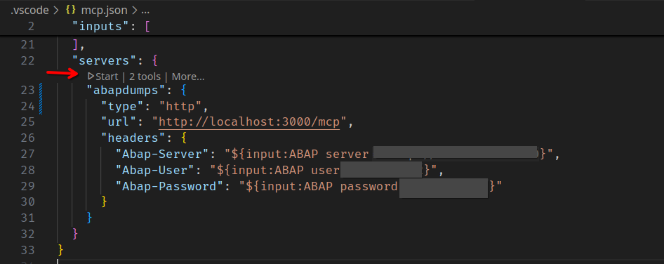

# MCP server for SAP dumps

This will enable MCP clients to analyse SAP dumps.
Inspired by [mcp-windbg](https://github.com/svnscha/mcp-windbg), explained in [this blog](https://svnscha.de/posts/ai-meets-windbg/)

The idea is to enable AI tools to access dumps and ask details about them like description, call stack,...

The client usually needs a configuration file, like [mcp.json](.vscode/mcp.json) for visual studio code, whose format depends on the application, see below for more details

You can run the server with

```bash
npx sapdumpmcp
```

## demo


## Headers

The SAP system details can be passed with headers:

* abap-server
* abap-user
* abap-password
* abap-language

The default values can be set in a .env file for debugging, shouldn't be used in production

## Testing

Running the *develop* launch configuration will:

* start the *dev* job - will serve the mcp server on port 3000 and restart it on code changes
* start the *inspect* job - will start an mcp inspector on port 6274, with a proxy on 6277
* start the debugger

you can test the server by connecting to the [mcp inspector](http://127.0.0.1:6274) and select transport type **Streamable HTTP** and URL **[http://localhost:3000/mcp](http://localhost:3000/mcp)**

Will only work if your .env file points to a valid server, as the inspector doesn't support headers based connections

## Environment variables

Instead of using http headers, the server can be configured to use rnvironment variables (perhaps stored in a .env file)
This will allow anyone with access to the server to run queries, so it's not recommended unless you restrict access in some other way
The relevant variables are:

* ABAP_ADT_URL
* ABAP_ADT_USER
* ABAP_ADT_PASSWORD
* PORT

By default the server will listen to port 3000

## Vscode/Github copilot

The mcp.json linked above works for visual studio code as long as:

* mcp is enabled (currently only available in preview)
* the *dev* job is running

To start the server you can use the command palette or the codelens on the mcp.json file:

